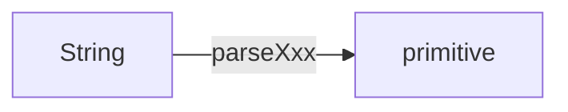
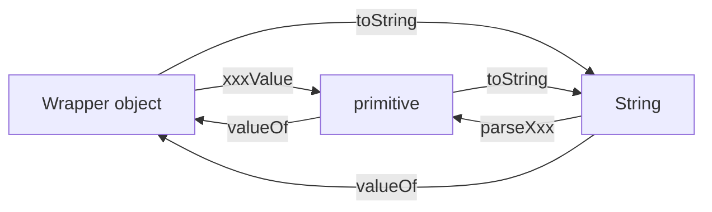
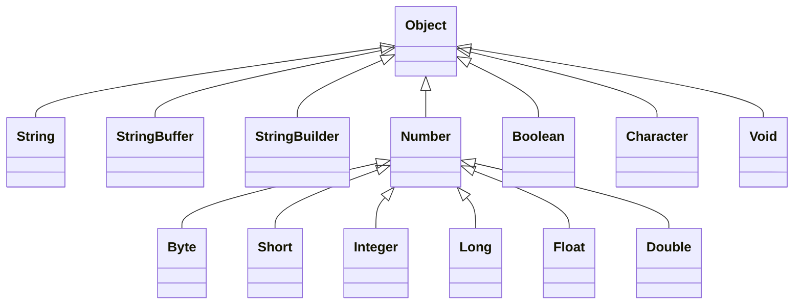

# utility methods:
## `parseXxx()`:
- We can use `parseXxx()` methods to to convert `String` to `primitive`
***Form 1:***
- Every wrapper class except `Character` class contains the following `parseXxx()` method to find a `primitive` for the given `String` object.
  `public static primitive parseXxx(String s);`
#### ***Example:***
  ``` java
    int i = Integer.parseInt("10");
    double d = Double.parseInt("10.5");
    boolean b = Boolean.parseBoolean("true"); 
  ```
***Form 2:***
- Every integral type wrapper class [`Byte`, `Short`,`Integer`, `Long`] contains the following `parseXxx()` method to convert specified radix `String` to `primitive`.\
  `public static primitive parseXxx(String s, int radix);`
- The allowed range of radix is *2* to *36*
#### ***Example:***
  ``` java
    int i = Integer.parseInt("1111", 2);
    System.out.println(i);  => 15
  ```

## `toString()`:
- We can `toString()` method to convert wrapper objects or primitives to  `String`.
***Form 1:***
- Every wrapper class contains the following `toString()` to convert wrapper objects to `String` type.
  `public String toString();`\
- It's an *overrided* version of `Object` class `toString()` method.
- Whenever we are trying to print wrapper object *reference* internally this `toString()` method will be called.
#### ***Example:***
  ``` java
   Integer I = new Integer(10);
   String s = I.toString();
   System.out.println(s);   => 10
   System.out.println(I);   <=>  System.out.println(I.toString()); => 10 
  ``` 
***Form 2:***
- Every wrapper class including `Character` class contains the following *static* `toString()` to convert `primitive` to `String`.
  `public static String toString(primitive p);`\
#### ***Example:***
  ``` java
   String s = Integer.toString(10);
   String s = Boolean.toString(true);
   String s = Character.toString('a');
  ```
***Form 3:***
- `Integer` and `Long` classes containn the following `toString()` method to convert `primitive` to specified radix `String`.\
  `public static String toString(primitive p, int radix);`
- The allowed range of radix is *2* to *36*
#### ***Example:***
  ``` java
   String s = Integer.toString(15, 2);
   System.out.println(s);  => 1111
 ```
***Form 4:*** **`toXxxString()`**
- `Integer` and `Long` classes contain the following `toXxxString()` methods:\
  `public static String toBinaryString(primitive p);`\
  `public static String toOctalString(primitive p);`\
  `public static String toHexString(primitive p);`
#### ***Example:***
   ``` java
   String s = Integer.toBinaryString(10);
   System.out.println(s);                   => 1010

   String s = Integer.toOctalString(10);
   System.out.println(s);                   => 12

   String s = Integer.toHexString(10);
   System.out.println(s);                   => a
   ```

# Dancing between String, wrapper object and primitive:

# Partial hierarchy of java.lang package:

***Conclusions:***
- The wrapper classes which are not child class of `Number` are `Boolean` and `Character`.
- The wrapper classes which are not direct child of `Object` are `Byte`, `Short`, `Integer`, `Long`, `Float` and `Double`.
- `String`, `StringBuffer` and `StringBuilder` and all wrapper classes are `final` classes.
- In addition to `String` object all wrapper class objects are ***immutable***.
- Sometimes `Void` class is also considered as wrapper class.

***Note:***
```
    javap java.lang.Void
```
Will give the following output:
- public final class java.lang.Void extends hava.lang.Object 

It's a final class and a direct child of `Object`. It doesn't contain any methods and it contains only one variable: `Void.Type`.\
In general we can use `Void` class in reflection to check whether the method's return type is `void` or not.
``` java
    if (getMethod("m1").getReturnType() == Void.Type) {
        // logic here
    }
```
`Void` is the class representation of `void` keyword in java.
