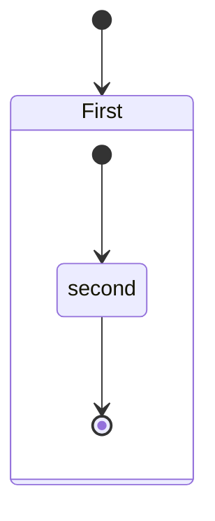
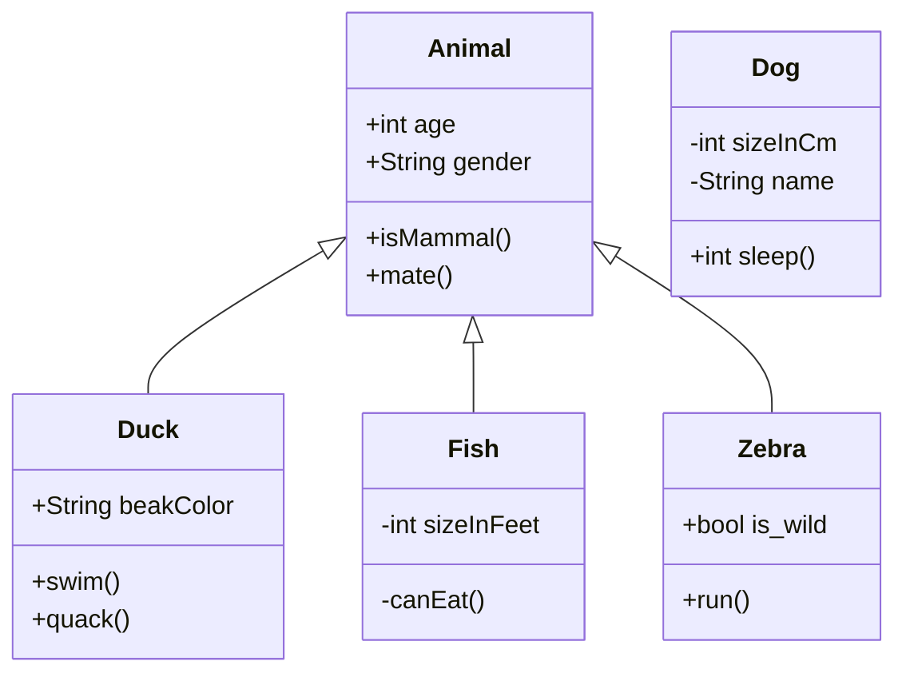
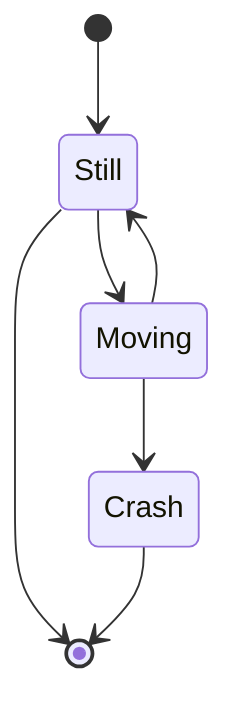
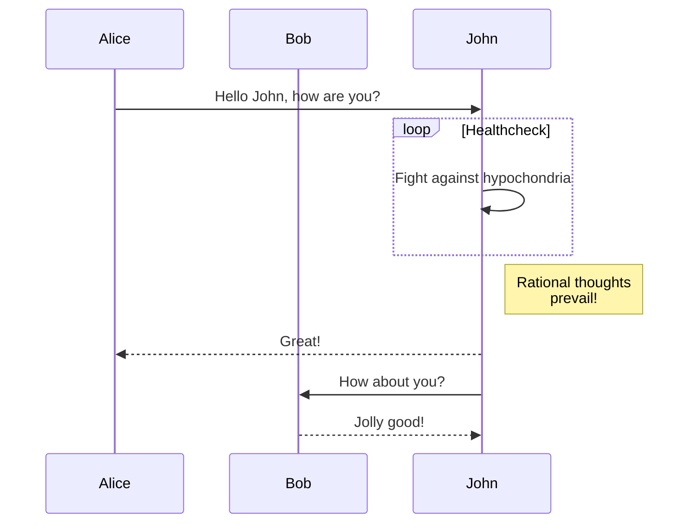
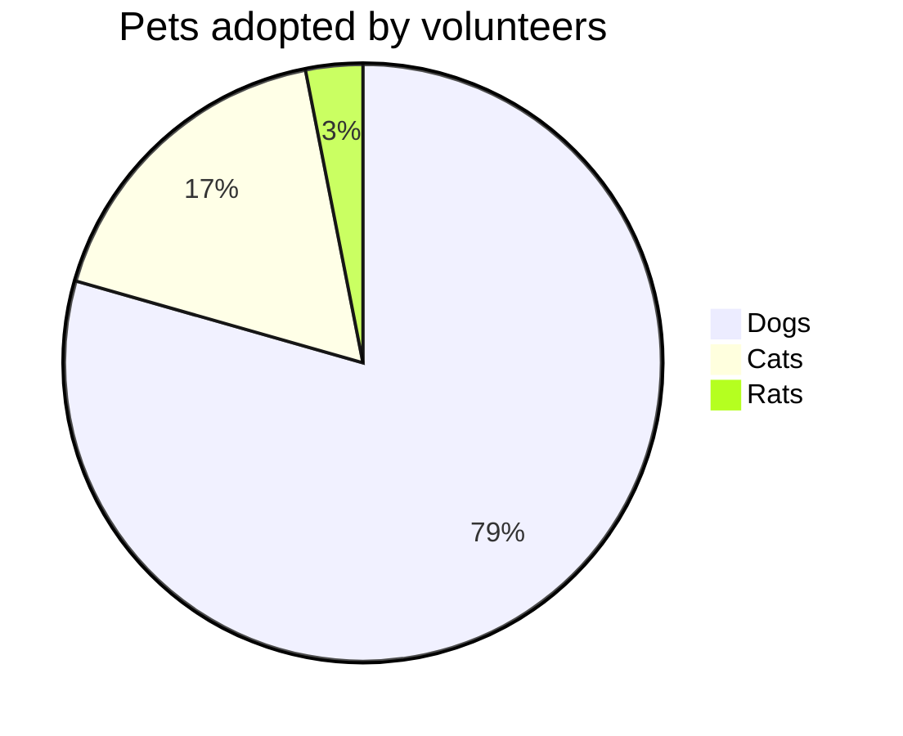
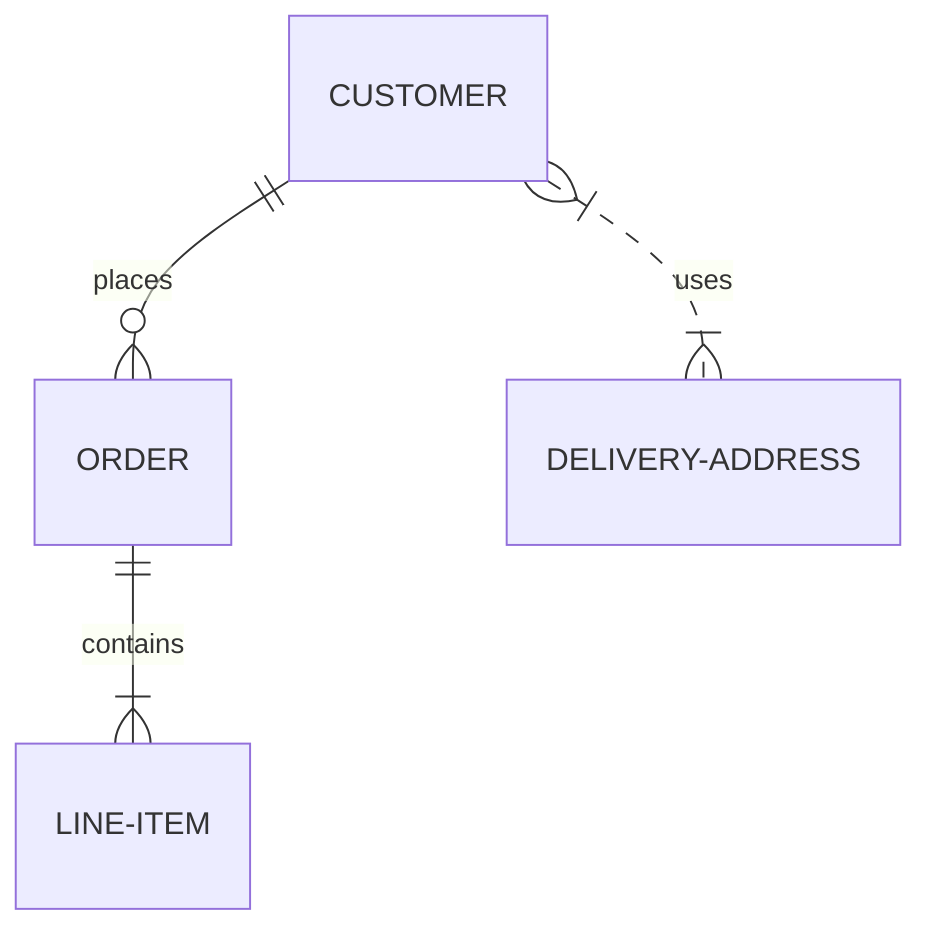

# State Diagram

# Class Diagram


# State Diagram


# Sequence Diagram

# Pie 

# Graph TD
```mermaid
graph TD

    C -->D[Laptop]
    C -->E[iPhone]
    C -->F[fa:fa-car Car]|   |   |
|   |   |
|---|---|
|   |   |
|   |   |
|---|---|
|   |   |
|   |   |
|---|---|
|   |   |

```
# ER Diagram


# ER Diagram


$$
\ell = \sum_{i}^{N}(y_i - \hat{y}_i)^2 - ||w||_2^2
$$


