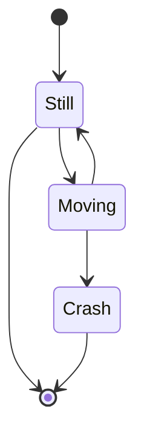

# Pointers

## How to declare a pointer: 
``` c
int *ptr;
char* ptr;
float* ptr
```
- Declaring a pointer is not enough.
- It is important to initialize pointer before use.
- One way to initialize a pointer is to assign address of some variable.

## how to initialize a pointer:
``` c
int x = 5
int* ptr;
ptr = &x;
```
- ***`ptr = &x`*** means assing address of variable `x` to pointer variable `ptr`.

- We can also write the whole thing in a single line: 
``` c
int x = 5, *ptr = &x
```
## Value of operator:
Value of operator/*indirection* operator/*dereference* operator that is used to access the value stored at the location pointed by the pointer.
``` c
int x = 5;
int* ptr;
ptr = &x;
printf("%d", *ptr); => 5
```    
      
        
## General rule:
if p points to `a[i]`, then:
```
p = p + j <=> &a[i + j]

p = p - j <=> &a[i - j]

a[i] = *(a + i)
```

## Example:
The following code can be written in two different ways:
-   ``` c
    for (p = a; p < &a[4]; p++) {

    }
    ```
-   ``` c
    for (p = a; p < a + 4; p++) {

    }
    ```
## Row vs Column major:

C stores multidementional arrays in row major order. \
Using pointers we can transform these loops:
``` c
for (int i = 0; i < row; i++) {
    for (int j = 0; j < col; j++) {
        printf("%d ", a[i][j]);
    }
}
```
into a single loop:

``` c
for (p = &a[0][0]; p <= &a[row - 1][col - 1]; p++) {
    printf("%d ", *p);
}
```

# State Diagram

$$ \alpha \beta \gamma \rho \sigma \delta \epsilon $$
$$ \int \oint \sum \prod $$
$$E=mc^2$$
$$x^n + y^n = z^n$$
$$a^2+b^2=c^2$$
